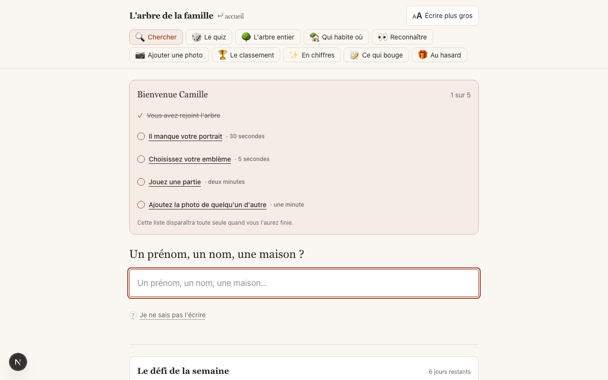
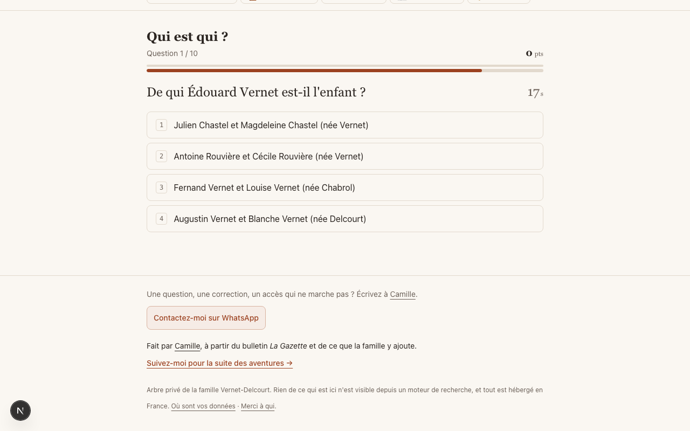
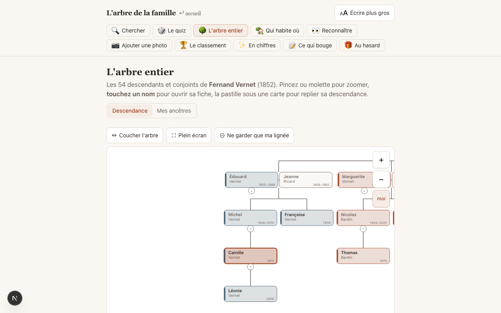
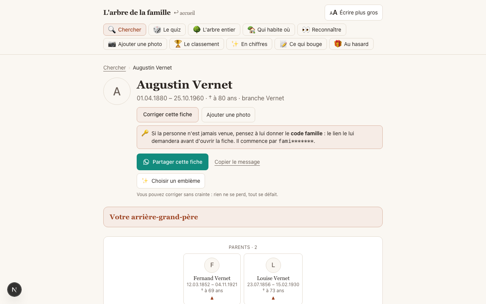
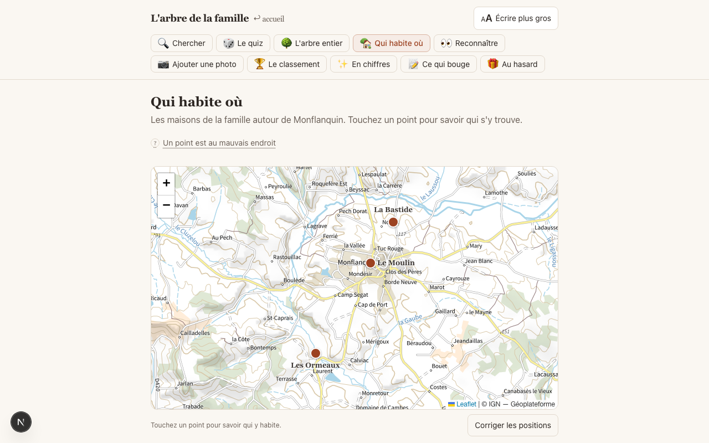

# 🌳 Family Tree Quiz

Un arbre généalogique familial **privé et jouable** : les fiches de toute la famille, un quiz
généré depuis l'arbre (« qui est la mère de… ? », « de quelle branche descend… ? »), la carte
des maisons de famille, les anniversaires, un journal des contributions — et un accès par
simple code famille, sans mot de passe individuel.

Construit pour une vraie famille de ~700 fiches et ~80 membres actifs. Publié ici avec une
**famille de démonstration entièrement fictive** (les Vernet-Delcourt).

> 🇫🇷 L'interface est en français.

## Aperçu

*Captures prises sur la démo — toutes les personnes sont fictives.*

| Accueil | Le quiz |
|---|---|
|  |  |

| L'arbre | Une fiche | La carte |
|---|---|---|
|  |  |  |

## Fonctionnalités

- **Fiches** : filiation, unions, photos (bucket privé, liens signés), anecdotes, sources.
- **Arbre interactif** : rendu serveur au premier affichage, pli/dépli côté client,
  navigation de proche en proche.
- **Quiz** : questions générées depuis le graphe familial (filiation, fratries, branches,
  visages), niveaux progressifs, anti-répétition par cookie, mode « une seule branche »,
  duels entre joueurs, classement par branche et par camp.
- **Carte** : les maisons de famille sur un fond Leaflet, avec leurs histoires.
- **Accès** : entrée par code famille (`rejoindre_avec_code`), allowlist optionnelle,
  RLS Postgres partout (`is_member()`), journal d'audit avec restauration.
- **Recherche** : trigrammes + `unaccent` — tolérante aux fautes et aux accents.

## Stack

| Couche | Choix |
|---|---|
| Framework | Next.js 16 (App Router) · React 19 · TypeScript |
| Styles | Tailwind CSS 4 |
| Base | Supabase — Postgres + RLS, Auth, Storage (photos + vignettes) |
| Carte | Leaflet |
| Hébergement | Vercel (+ Vercel Analytics) |
| QA | Playwright |

Développé avec [Claude Code](https://claude.com/claude-code).

## Démarrage

1. **Créer un projet [Supabase](https://supabase.com)**, puis appliquer le schéma :
   - `supabase/migrations/0001_init.sql` (schéma complet : tables, RLS, fonctions)
   - `supabase/migrations/0002_storage.sql` (bucket photos privé)
   - `supabase/seed-demo.sql` (la famille fictive de démonstration, 54 fiches)
2. **Configurer l'app** :
   ```bash
   cp .env.example .env.local   # y mettre l'URL et la clé anon du projet
   npm install
   npm run dev
   ```
3. **Entrer** : sur `/rejoindre`, code famille `famille2026` (défini dans `seed-demo.sql`).

## Adapter à votre famille

- `src/lib/branches.ts` — les branches, leurs couleurs (`src/app/globals.css`) et les deux
  « camps » du duel.
- `src/lib/pays.ts` — le quiz « pays » : remplacez les questions par votre région.
- `src/lib/contact.ts` — le contact du gardien (WhatsApp, fiche).
- `src/app/rejoindre/page.tsx`, `src/app/layout.tsx` — les textes d'accueil et le nom du site.
- Cherchez `Vernet` dans `src/` pour trouver les textes de la famille de démonstration.
- **Importer votre vraie famille** (FamilySearch, GEDCOM, recherche d'actes assistée
  par IA — Léonore, archives départementales) : [docs/IMPORT-GENEALOGIE.md](docs/IMPORT-GENEALOGIE.md).

## Garde-fou

Avant tout commit contenant vos vraies données… ne commitez jamais vos vraies données.
`scripts/verification/scan-anonymisation.sh` est le garde-fou utilisé pour ce repo.

## Licence

MIT — voir [LICENSE](LICENSE).
