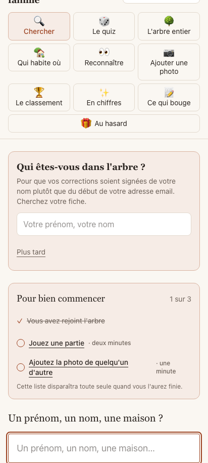
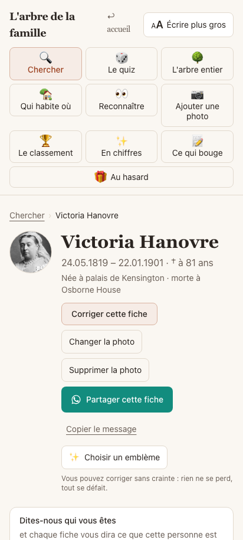
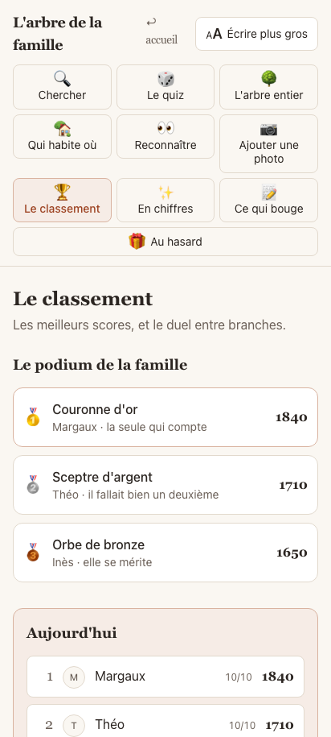
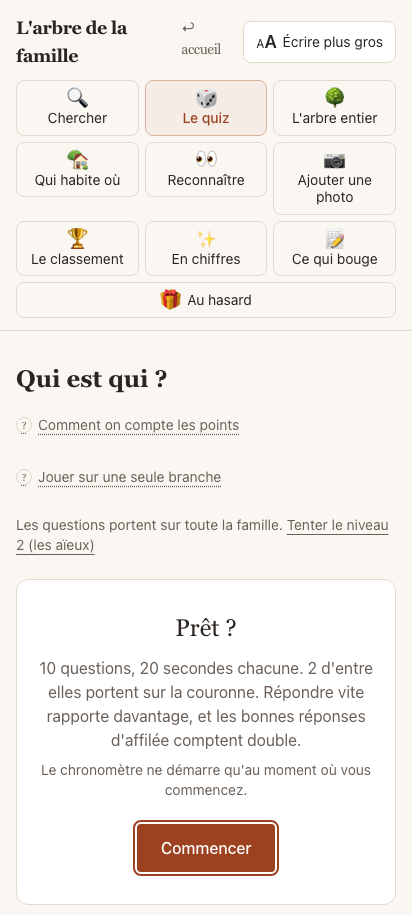
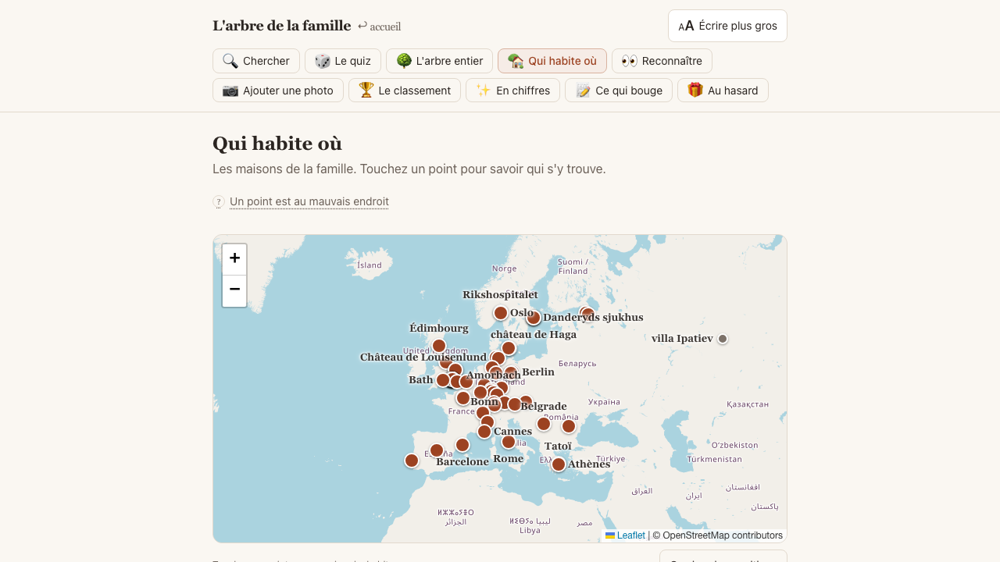

# 🌳 Family Tree Quiz

Un arbre généalogique familial **privé et jouable** : les fiches de toute la famille, un quiz
généré depuis l'arbre (« qui est la mère de… ? », « de quelle branche descend… ? »), la carte
des maisons de famille, les anniversaires, un journal des contributions — et un accès par
simple code famille, sans mot de passe individuel.

Construit pour une vraie famille de ~700 fiches et ~80 membres actifs. Publié ici avec deux
jeux de données de démonstration : **la descendance de la reine Victoria** (1 725 fiches,
488 portraits, importés de Wikidata et Wikimedia Commons) et une petite **famille fictive**
(les Vernet-Delcourt, 54 fiches) pour démarrer en local.

> 🇫🇷 L'interface est en français.

## 👑 Démo en ligne

**[la-famille-windsor.vercel.app](https://la-famille-windsor.vercel.app)** — entrez d'un clic,
jouez au quiz, parcourez l'arbre depuis Victoria, la carte des résidences royales et le
classement. Lecture seule : les visiteurs jouent et corrigent rien. Données Wikidata (CC0),
photos Wikimedia Commons créditées sur la page `/credits`.

## Aperçu

*Captures prises sur la démo Windsor.*

| Entrée | Une fiche | Le classement |
|---|---|---|
|  |  |  |

| Le quiz | La carte |
|---|---|
|  |  |

## Fonctionnalités

- **Fiches** : filiation, unions, photos (bucket privé, liens signés), anecdotes, sources.
- **Arbre interactif** : rendu serveur au premier affichage, pli/dépli côté client,
  navigation de proche en proche.
- **Quiz** : questions générées depuis le graphe familial (filiation, fratries, branches,
  visages), niveaux progressifs, anti-répétition par cookie, mode « une seule branche »,
  duels entre joueurs, classement par branche et par camp.
- **Carte** : les maisons de famille sur un fond Leaflet, avec leurs histoires.
- **Accès** : entrée par code famille (`rejoindre_avec_code`), allowlist optionnelle,
  RLS Postgres partout (`is_member()`), journal d'audit avec restauration.
- **Recherche** : trigrammes + `unaccent` — tolérante aux fautes et aux accents.

## Stack

| Couche | Choix |
|---|---|
| Framework | Next.js 16 (App Router) · React 19 · TypeScript |
| Styles | Tailwind CSS 4 |
| Base | Supabase — Postgres + RLS, Auth, Storage (photos + vignettes) |
| Carte | Leaflet |
| Hébergement | Vercel (+ Vercel Analytics) |
| QA | Playwright |

Développé avec [Claude Code](https://claude.com/claude-code).

## Démarrage

1. **Créer un projet [Supabase](https://supabase.com)**, puis appliquer dans l'ordre :
   - `supabase/migrations/0001_init.sql` (schéma complet : tables, RLS, fonctions)
   - `supabase/migrations/0002_storage.sql` (bucket photos privé)
   - `supabase/migrations/0003_demo_windsor.sql` (camps par colonne, mode lecture seule)
   - un seed : `supabase/seed-windsor.sql` (la démo, 1 725 fiches) **ou**
     `supabase/seed-demo.sql` (les Vernet-Delcourt, 54 fiches, code `famille2026`)
   - facultatif : `supabase/seed-windsor-scores.sql` (un classement déjà peuplé)
2. **Configurer l'app** :
   ```bash
   cp .env.example .env.local   # y mettre l'URL et la clé anon du projet
   npm install
   npm run dev
   ```
3. **Entrer** sur `/rejoindre`. Avec le seed Windsor, un clic suffit (`CODE_PUBLIC` dans
   `src/lib/famille.ts`) ; avec les Vernet-Delcourt, code famille `famille2026`.
4. **Photos de la démo Windsor** : `scripts/import-wikidata/4_photos.py --ecrire`
   (variables `SUPABASE_URL` et `SUPABASE_SERVICE_KEY`) télécharge et crédite les 488
   portraits Commons. Voir `scripts/import-wikidata/LISEZ-MOI.md`.

## Adapter à votre famille

Tout ce qui nomme la famille est dans **un seul fichier : `src/lib/famille.ts`** — le titre,
les branches et leurs couleurs, les deux camps du duel, la racine de l'arbre, le gardien et
ses liens, le fond de carte (IGN pour la France, OpenStreetMap ailleurs), les questions
« pays » du quiz, le code d'entrée public ou non. Voir [docs/SELF-HOSTING.md](docs/SELF-HOSTING.md).

- `src/lib/contact.ts` — le numéro WhatsApp du gardien, s'il y en a un.
- `supabase/seed-demo.sql` — le patron d'un seed : mêmes colonnes pour votre famille.
- **Importer votre vraie famille** (FamilySearch, GEDCOM, recherche d'actes assistée
  par IA — Léonore, archives départementales) : [docs/IMPORT-GENEALOGIE.md](docs/IMPORT-GENEALOGIE.md).

## Garde-fou

Avant tout commit contenant vos vraies données… ne commitez jamais vos vraies données.
`scripts/verification/scan-anonymisation.sh` est le garde-fou utilisé pour ce repo.

## Licence

MIT — voir [LICENSE](LICENSE).
